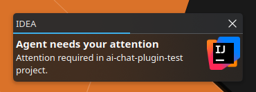

# AI Chat Notifications

AI Chat Notifications is an IntelliJ Platform Plugin that shows a desktop notification
when an AI Coding Agent that runs in the IDE needs your attention.

## Use Case

You start a development task, ask an AI Agent to do the work, then minimize the IDE, or switch to another app while it runs.
When the agent needs approval, input, or a decision, that prompt is easy to miss.

This plugin observes JetBrains AI Assistant chat session state and sends a desktop notification
when an agent starts waiting for your attention. It does not depend on the AI chat UI being visible,
so it continues to work while the IDE window is minimized.

## License

This project is licensed under the [Apache License 2.0](LICENSE).
